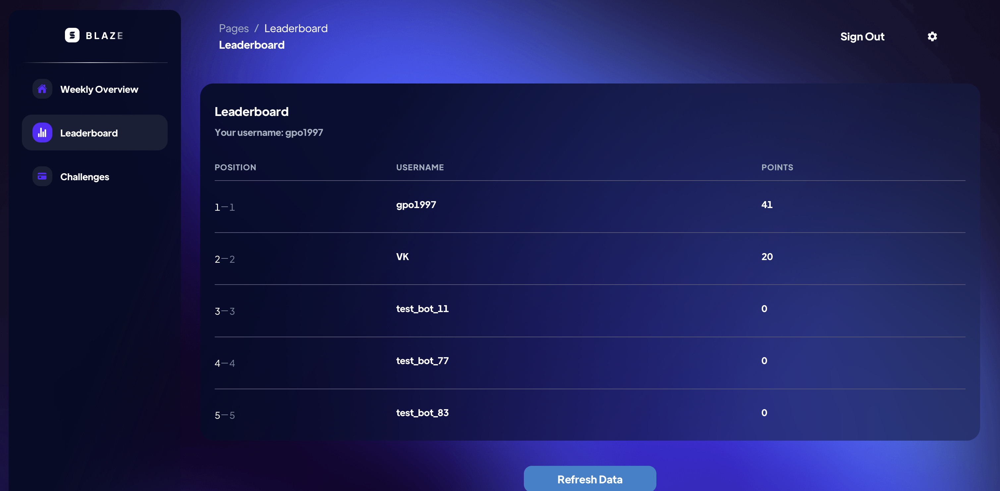
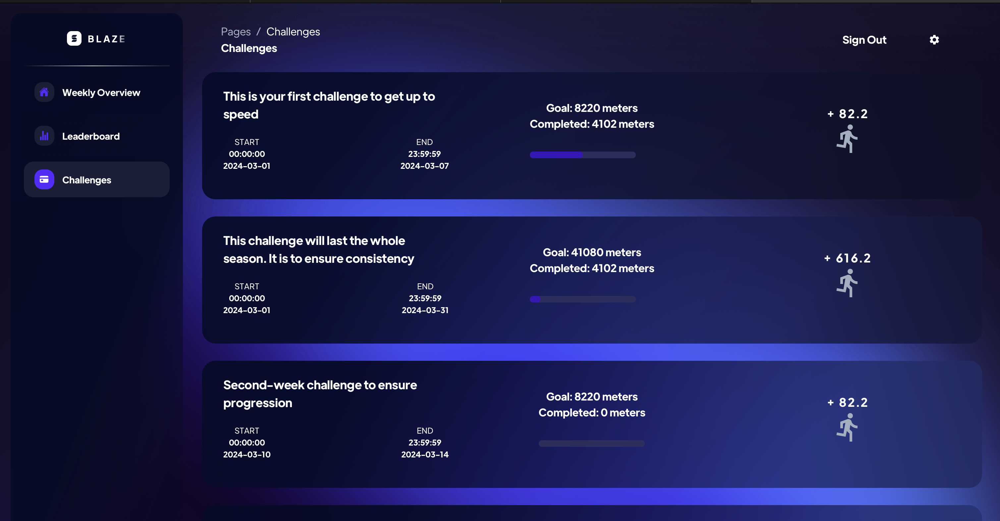

# Gamified Running App

Welcome to the repository for our gamified running app "Blaze". Experience our app live: [Blaze](https://master.d3tdusvelb9wc3.amplifyapp.com)

Our app is a unique application that combines the joy of running with the excitement of gaming, designed to motivate you to stay active and healthy while having fun competing in challenges and climbing up the leaderboard.

## Microservices Architecture

Our application is built on a microservices architecture, enhancing its scalability and maintainability. The system is divided into four main microservices:

- **Training:** Manages individual training sessions and progress tracking.
- **Leaderboard:** Keeps track of user rankings and achievements.
- **Challenges:** Creates and manages running challenges for users.
- **Partners:** Handles partnerships and integrations with other services.

In addition to these microservices, we have a frontend repository for our user interface and a general repository that includes a system-wide library of helper functions.

## Repositories Structure

We manage a total of 19 repositories with a consistent naming convention to ensure clarity and ease of navigation: `microserviceName_function`. For example, `trainings_processor`.

### Repository Structure

Each repository is structured to include the following:

- **Code and Test Scripts:** All the necessary code files and scripts for testing functionalities.
- **Build Pipeline:** Located in `.github/workflows`, this includes configuration for unit testing and automatic deployment to AWS Lambda or GitHub Container Registry (GHCR).
